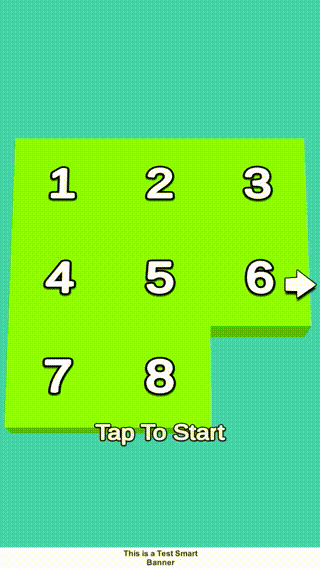

# unity-slidepuzzle-template

## このプロジェクトについて
App Store, Google Play向けに公開するカジュアルゲームのテンプレートです。\
このテンプレートには以下の特徴があります。
* 完成されたスライドパズルゲーム一式
* Android, iOS向けの開発版・製品版ビルド
* Admobによるバナー・インタースティシャル広告の表示
* レビュー誘導機能

## 事前準備
iOSはMac OS上でしかビルドできないのでこちらを想定しています。（WinでもAndroidビルドは可能です）

* Unity 2021.3.12f
    * Android Build Support
    * iOS Build Support
* 最新のXCode, XCode Command Line Tools

## Editorでの起動方法
`Assets/SlidePuzzle/Scenes/Game.unity`を開いてPlay Buttonを押してください。

## 開発版のビルド方法
#### Android
1. 上メニューの[Builder]より[Build Android Debug]を実行
2. `Build/slidepuzzle.apk`が作成されます

#### iOS
1. `Assets/SlidePuzzle/Scripts/Editor/Builder.cs`の`PlayerSettings.iOS.appleDeveloperTeamID`に自身のTeamIDを入力
2. 上メニューの[Builder]より[Build iOS Debug]を実行
3. `Builds/iOS`にプロジェクトが作成されます
4. `unity-slidepuzzle-template`に移動し、`./Data/build-ios.sh`を実行
5. `Build/slidepuzzle.ipa`が作成されます

## 製品版のビルド方法
#### 事前準備
`Assets/SlidePuzzle/Scripts/Admob.cs`のAppIDに自身のAdmobで作成したIDを入力

#### Android
1. ProjectSettingsのKeyStore Managerなどを使用して`Data/Keystore/`下にkeystoreファイルを作成
2. `Assets/SlidePuzzle/Scripts/Editor/Builder.cs`の`useCustomKeystore`以下に自身のkeystore情報を記入
3. 上メニューの[Builder]より[Build Android Release]を実行
4. `Build/slidepuzzle.aab`が作成されます

#### iOS
1. `Assets/SlidePuzzle/Scripts/Editor/Builder.cs`の`PlayerSettings.iOS.appleDeveloperTeamID`に自身のTeamIDを入力
2. 上メニューの[Builder]より[Build iOS Release]を実行
3. `Builds/iOS`にプロジェクトが作成されます
4. XCodeよりビルドしApp Store Connectにアップロードします
